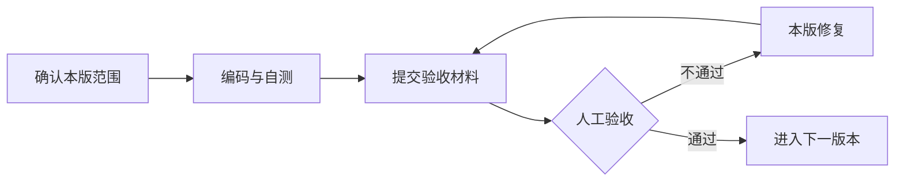
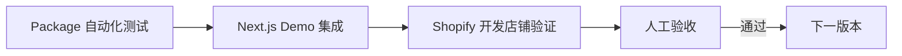

# BestTrack Page Builder 开发编码计划

> 包名：`@standhigher/puck-page-builder`  
> 版本：V1.2  
> 日期：2026-09-16  
> 上位文档：《BestTrack Page Builder 详细设计实现》

## 1. 开发原则

采用“小版本开发、人工验收、通过后继续”的方式推进：



执行约束：

- 一次只开发一个版本，不提前实现下一版本；
- 每版必须可以独立运行和演示，不接受只有接口或空实现；
- 每版必须提交代码清单、运行方式、自动化测试结果、验收清单和已知问题；
- 每版必须接入真实 Next.js Shopify App Demo，并在开发店铺完成集成验证；
- Storybook、静态页面和本地 Mock 只能作为开发辅助，不能代替版本验收；
- 人工验收未通过时，只修复当前版本；
- 用户明确回复“验收通过”后，才能打 Tag 并进入下一版本；
- Admin 编辑器使用已确认的 Shopify 融合型 Builder UI，Polaris 仅承担通用组件、交互和无障碍基线；
- 消费者页面继续使用商家品牌样式，并与编辑器 UI 隔离。

每版统一验收门禁：



## 2. 版本总览

| 版本 | 目标 | 人工验收重点 | 状态 |
|---|---|---|---|
| V0.1 | 基础工程与 EditorShell 骨架 | 工程、Puck 接入和基础交互 | 技术完成，UI 未通过 |
| V0.1.1 | Builder UI 与真实 Shopify Demo 基线 | 视觉基线、Embedded App 和开发店铺运行 | 下一步 |
| V0.2 | PageDocument 与最小渲染闭环 | 同一文档可编辑、保存、重新渲染 | 待开发 |
| V0.3 | Extension API 与 Registry | 新扩展可注册，不修改核心代码 | 待开发 |
| V0.4 | 完整编辑体验 | 拖拽、配置、撤销、设备预览 | 待开发 |
| V0.5 | 草稿、校验与迁移 | 草稿恢复、错误定位、旧数据升级 | 待开发 |
| V0.6 | Runtime Context 与 DataSource | Mock/Live/Runtime 数据正确切换 | 待开发 |
| V0.7 | BestTrack 模板与业务资源 | 三类模板和 Shopify 资源选择 | 待开发 |
| V0.8 | 预览、发布、版本与回滚 | 发布闭环、失败保护、版本回滚 | 待开发 |
| V0.9 | Email Renderer 与多 Target | Web/Email 能力隔离和正确输出 | 待开发 |
| V1.0 | 稳定性治理与正式发布 | 完整 E2E、性能、安全和文档 | 待开发 |

## 3. 分版本计划

### V0.1 基础工程与 EditorShell 骨架

目标：建立可持续开发的工程基线，完成空白编辑器外壳。

开发内容：

- 初始化公共包、演示 App、构建与发布配置；
- 建立 `core`、`editor`、`adapters`、`runtime`、`renderer` 和 UI 基础目录；
- 接入 Puck 和初版 UI 适配层；
- 实现 EditorShell、Toolbar、Blocks / Outline 双视图、Canvas、右侧属性面板；
- Blocks 卡片视图与 Outline 紧凑视图使用同一份演示区块和选中状态；
- 实现独立 Component Picker 外壳，由“添加模块”入口打开；
- Canvas 使用 iframe，支持桌面、平板、手机、全屏和缩放外壳；
- 展示完整保存状态、Mock/Live Preview 入口、发布和菜单动作；
- 区分 Editor Language 与 Page Locale 入口；
- 接入 ESLint、TypeScript、单元测试和 CI 基础检查；
- 提供桌面端与窄屏演示页面。

本版只实现可交互 UI 和演示状态，不实现 PageDocument、真实保存、Live DataSource、发布接口和 Shopify Menu 调用。

人工验收：

- 项目可按 README 一次启动；
- 编辑器四个区域完整显示，无明显错位或溢出；
- Blocks / Outline 展示同一批区块，切换后选中和排序状态保持一致；
- “添加模块”可以打开并关闭独立组件选择面板；
- Canvas 使用 iframe，Admin 样式不会污染预览内容；
- 保存、预览、发布和菜单动作边界清楚，但不发起真实请求；
- Editor Language 与 Page Locale 标签明确、状态独立；
- Button、Form、Modal、Banner、Toast 等基础 UI 不重复自研；
- 颜色、间距、圆角、字体使用统一 Token；
- 红色仅用于错误或破坏性操作，不作为普通选中态和主操作色；
- 桌面端和窄屏下核心区域可用；
- `lint`、`typecheck`、`test`、`build` 全部通过。

验收结论：Puck 接入和功能骨架已完成；视觉层级、画布真实性和专业编辑器体验未达到预期，UI 验收不通过，不进入 V0.2。

### V0.1.1 Builder UI 与真实 Shopify Demo 基线

目标：完成已确认的 Shopify 融合型视觉基线，并建立后续所有版本共用的真实 Shopify App 验证环境。

开发内容：

- 新增 `apps/demo-shopify-app`，使用 Next.js、React、TypeScript 和 Shopify App 配置；
- Demo 通过 workspace 依赖接入 `@standhigher/puck-page-builder`，禁止复制包内源码；
- 跑通 Shopify 开发店铺安装、Embedded App、App Bridge 和 Session Token；
- 跑通一个最小鉴权接口和 App Proxy 测试入口，不提前实现业务发布能力；
- 建立 `ui/builder` 与 `ui/shopify`，实现 Builder UI Design Token；
- 将顶部区域收敛为单层主工具栏，设备与缩放操作归入 Canvas Toolbar；
- 实现 64px Tool Rail、可收起左侧面板、弹性 Canvas 和右侧 Inspector；
- Blocks 保持卡片操作视图，Outline 保持紧凑结构视图，二者共享数据与选中状态；
- 区块低频动作仅在 Hover、Selected 或更多菜单中出现；
- Canvas 渲染真实 Storefront 页面，使用 Overlay 展示 Hover、Selected、标签和浮动操作条；
- Inspector 使用“内容 / 样式 / 高级”三级页签；
- 增加 1440px、1920px 视觉回归基线和窄屏面板收起验证；
- 更新 README，说明 Demo 安装、环境变量、启动和开发店铺验证方式。

本版不实现 PageDocument、真实草稿保存、完整 DataSource、正式发布、版本回滚和 Shopify Menu 业务能力。

人工验收：

- Demo App 可安装并嵌入真实 Shopify 开发店铺；
- App Bridge 初始化正常，Session Token 可访问最小鉴权接口；
- App Proxy 测试入口可从开发店铺访问；
- 编辑器只有一层主工具栏，不重复出现编辑模式和大号语言入口；
- Tool Rail、左右面板和 Canvas 的层级、尺寸及收起行为符合视觉基线；
- 未选中时 Canvas 与 Storefront 页面一致，不呈现后台 Card 包裹；
- Hover、Selected、Overlay 和 Inspector 状态清楚，不污染 Storefront DOM；
- Blocks / Outline 状态同步，低频操作默认隐藏；
- 1440px 与 1920px 截图和已确认方案无明显结构偏差；
- Storybook 或本地页面不能作为验收入口；
- `lint`、`typecheck`、`test`、`build` 全部通过；
- 人工确认“V0.1.1 验收通过”后，才进入 V0.2。

### V0.2 PageDocument 与最小渲染闭环

目标：跑通平台数据模型与 Puck 的双向转换。

开发内容：

- 定义 `PageDocument V1`、BlockNode、PageSettings；
- 实现 Schema 校验和默认值；
- 实现 Puck Adapter 的 `toEngineData`、`fromEngineData`；
- 实现最小 Web Renderer；
- 提供 Text、Image 两个示例区块；
- 增加 Adapter 双向转换测试。

人工验收：

- 可加载一份 PageDocument 进入编辑器；
- 修改文本和图片后可导出新的 PageDocument；
- 刷新并重新加载后内容一致；
- 同一份文档在 Editor 和 Web Renderer 中结果一致；
- 持久化数据中不存在 Puck 私有结构。

### V0.3 Extension API 与 Registry

目标：业务能力通过扩展注册，不修改 Page Builder Core。

开发内容：

- 实现 Block、Field、Action、Template、Renderer、DataSource Registry；
- 实现 Extension 合并、排序、冲突检查和禁用机制；
- 实现 Lifecycle Hooks 和 UI Slots；
- 提供一个独立 BestTrack 示例 Extension；
- 增加重复 Key、非法依赖和装配顺序测试。

人工验收：

- 新增一个业务 Block 不需要修改 Core；
- 自定义 Field、Toolbar Action 和 Template 可独立注册；
- 重复 Key 能明确报错；
- 禁用 Extension 后相关能力不再显示；
- Extension API 不暴露 Puck 类型。

### V0.4 完整编辑体验

目标：形成可实际使用的单页编辑能力。

开发内容：

- 区块添加、删除、复制、拖拽排序和属性配置；
- Undo/Redo、选中态、未保存状态和离开提醒；
- 桌面、平板、手机设备预览；
- EditorContext、Action 状态和快捷键；
- Admin 文案国际化基础能力；
- 补齐 Loading、Empty、Error、Disabled 和 Success 状态。

人工验收：

- 完成“添加→拖拽→配置→撤销→重做”主流程；
- 三种设备视图切换正确；
- 未保存离开时有明确提示；
- 键盘可完成主要操作，焦点行为正常；
- 编辑器布局、交互和反馈符合 Builder UI 视觉基线。

### V0.5 草稿、校验与迁移

目标：页面可以可靠保存，并支持数据模型演进。

开发内容：

- 草稿创建、读取、更新和自动保存；
- 乐观锁与保存冲突处理；
- Schema、Block 和发布前三级校验；
- 错误定位到具体区块和字段；
- Schema Migration 与 Unknown Block 降级展示；
- 保存和迁移日志。

人工验收：

- 刷新页面后草稿内容可恢复；
- 两个页面同时编辑时能发现版本冲突；
- 非法配置不能保存或发布，并能定位错误；
- 旧版示例数据可自动迁移；
- 未注册区块不会导致整个编辑器崩溃。

### V0.6 Runtime Context 与 DataSource

目标：同一区块在编辑、预览和消费者环境中切换不同数据实现。

开发内容：

- 实现 RuntimeProvider、Runtime Context、DataSource Registry；
- 实现 `useDataSource()`、请求状态、取消、去重和错误处理；
- 实现 Tracking Query Mock DataSource；
- 实现通过 App Proxy/BFF 请求的 Live DataSource；
- 统一 Mock 与 Live 返回模型；
- 增加 DataSource 契约测试和 Telemetry 基础事件。

人工验收：

- Editor 与 Mock Preview 不调用真实物流接口；
- Live Preview 与 Runtime 调用真实接口；
- 同一个 Tracking Block 无需修改代码即可切换数据来源；
- PageDocument 不保存 API URL、Token 和请求实现；
- 请求失败、取消和重试状态展示正确。

### V0.7 BestTrack 模板与业务资源

目标：完成 Tracking Page 的主要业务编辑能力。

开发内容：

- Ready-to-go、Branded、Sales 三类模板；
- Tracking Query、Tracking Result、商品、集合和营销区块；
- Shopify 商品、集合、图片和菜单选择器；
- Asset Provider 和受控 Data Binding；
- 品牌颜色、Logo、文案和布局配置；
- 模板初始化、切换和兼容校验。

人工验收：

- 三类模板均可创建并独立编辑；
- 可选择真实商品、集合、图片和菜单；
- 模板切换不会产生非法或丢失数据；
- Tracking Page 可按商家品牌定制，不被编辑器样式覆盖；
- 非法资源和失效资源有明确降级提示。

### V0.8 预览、发布、版本与回滚

目标：完成页面从草稿到消费者生效的交付闭环。

开发内容：

- Mock Preview 与受控 Live Preview；
- 发布前校验、不可变版本和原子切换；
- 版本列表、版本详情和回滚；
- Shopify Menu 发布与状态反馈；
- 发布权限、Feature Flag、审计日志和缓存失效；
- 发布失败保护。

人工验收：

- 草稿变更不会影响线上页面；
- Live Preview 可验证真实数据；
- 发布成功后消费者页面立即使用新版本；
- 发布失败时线上仍保持旧版本；
- 可查看历史版本并一键回滚；
- Shopify Menu 发布结果明确可见。

### V0.9 Email Renderer 与多 Target

目标：验证公共模型可同时支持 Web 与 Email 场景。

开发内容：

- Renderer Registry 与 `target` 能力声明；
- Email Renderer、HTML 输出和 Inline CSS；
- Web/Email 区块兼容性校验；
- Email 变量白名单和服务端清洗；
- 邮件预览与 HTML 快照测试；
- 提供一份最小 Tracking Email 模板。

人工验收：

- Web 区块不能错误加入 Email 页面；
- Email 模板可编辑、预览并输出稳定 HTML；
- 邮件内容不包含脚本和未授权变量；
- Web 与 Email 共用 PageDocument 协议，但不强制共用最终 HTML；
- 常见邮件客户端预览无明显布局问题。

### V1.0 稳定性治理与正式发布

目标：达到公共包正式发布和 BestTrack 上线标准。

开发内容：

- 完整 E2E、视觉回归、契约和兼容性测试；
- 性能预算、按需加载、缓存和大文档限制；
- 错误边界、Telemetry、Dashboard 和告警字段；
- 安全检查、输入清洗、权限和敏感数据检查；
- API 文档、接入指南、Next.js Shopify Demo App 和版本变更记录；
- 发布 npm 正式版本并在 BestTrack 完成集成验证。

人工验收：

- 创建、编辑、保存、预览、发布、查询和回滚 E2E 全部通过；
- Admin UI 符合 Shopify 融合型 Builder UI 视觉基线，桌面端和窄屏模式可用；
- 核心性能指标达到约定预算；
- 异常可观测，日志不包含 Token 和敏感业务数据；
- BestTrack 实际环境完成回归；
- README 和接入示例可供其他 Shopify App 独立接入。

## 4. 每版验收交付模板

研发完成每个版本后，统一提交：

```text
版本：V0.x
代码分支 / Commit：
运行方式：
Next.js Demo 入口：
Shopify 开发店铺：
Embedded App 验证：
Session Token / App Proxy 验证：
本版完成内容：
自动化检查结果：lint / typecheck / test / build
视觉回归截图：1440px / 1920px
人工验收清单：
已知问题：
遗留项：
验收结论：待验收 / 通过 / 退回修改
```

验收通过后：

1. 合并当前版本代码；
2. 创建版本 Tag；
3. 更新版本状态和 Changelog；
4. 再确认下一版本范围；
5. 开始下一版本编码。

## 5. 当前行动

当前只启动 **V0.1.1 Builder UI 与真实 Shopify Demo 基线**。V0.1.1 人工验收通过前，不开发 PageDocument、Extension API 和其他后续能力。
