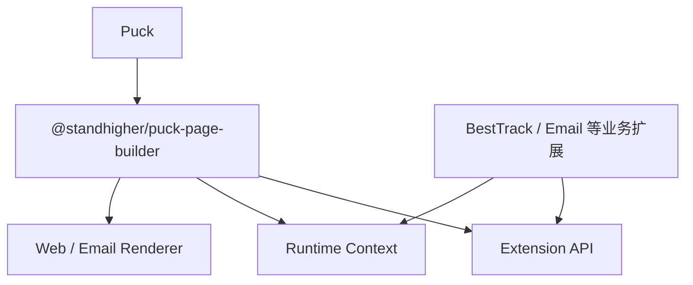
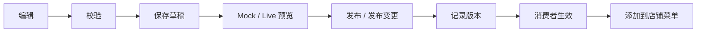

# BestTrack Page Builder 总体设计

> 版本：V1.1  
> 日期：2026-09-16

## 1. 文档概述

### 1.1 背景

BestTrack 需要建设可视化页面编辑能力，用于 Tracking Page 的创建、配置、预览与发布，并为后续 Email Template 及其他 Shopify App 场景提供复用基础。

本方案基于 Puck 封装 `@standhigher/puck-page-builder`，形成统一的 **Editor + Runtime 扩展框架**。基础包负责通用编辑能力，BestTrack 等业务项目通过扩展机制注入区块、属性、数据源和发布逻辑。

### 1.2 目标

- 支持 Ready-to-go、Branded、Sales 等模板；
- 支持区块添加、删除、排序、配置及多设备预览；
- 支持草稿保存、预览、发布、撤销/恢复和版本记录；
- 同一份 Page Schema 可用于编辑器、预览和消费者页面；
- 编辑/普通预览使用 Mock 数据，消费者端使用真实业务接口；
- 解耦 Page Builder、Shopify API 与具体业务逻辑；
- Admin 编辑器遵守 Shopify Polaris，消费者页面保留商家品牌化；
- 为 Tracking Page、Email Template 及其他 App 提供可复用基础设施。

### 1.3 本期边界

本期完成除协同编辑外的全部基础机制，并在 BestTrack Tracking Page 中落地验证。

暂不实现：多人协同编辑、Presence、CRDT 和实时冲突合并。

---

## 2. 设计原则

1. **基础设施与业务解耦**：基础包不包含 BestTrack、Shopify API 或具体发布逻辑。
2. **Schema 不保存接口 URL**：只描述页面内容及所需能力，接口地址由运行环境注入。
3. **编辑与渲染同源**：Editor、Preview、Consumer Runtime 使用同一份 Schema 和区块定义。
4. **多目标独立渲染**：Web 与 Email 复用编辑、模板和 Schema，但不强制复用最终 HTML。
5. **扩展优先**：新增业务能力通过 Extension API 接入，避免修改 Core。
6. **安全可控**：真实请求统一经过 DataSource、API Client 和业务网关，不允许页面配置任意接口。
7. **UI 边界清晰**：Admin 编辑器统一使用 Polaris；Canvas、Storefront 与 Email 按商家品牌和目标端渲染。

---

## 3. 总体架构



### 3.1 职责划分

| 层级 | 主要职责 |
|---|---|
| Puck | 基础拖拽编辑和组件编排能力 |
| Page Builder Core | Editor、Schema、历史、预览、扩展注册、Runtime 和通用渲染协议 |
| 业务扩展 | 具体区块、属性控件、模板、数据源、权限、发布及业务校验 |
| 业务网关/后端 | Shopify 数据访问、物流查询、鉴权、限流、数据标准化和持久化 |

---

## 4. 核心扩展机制

所有扩展能力统一收敛到 `Extension API`：

```ts
interface PageBuilderExtension {
  blocks?: BlockRegistry;
  fields?: FieldRegistry;
  actions?: ActionRegistry;
  renderers?: RendererRegistry;
  dataSources?: DataSourceRegistry;
  templates?: TemplateRegistry;
  hooks?: LifecycleHooks;
  validators?: Validator[];
  slots?: UISlots;
  i18n?: I18nProvider;
  permissions?: PermissionProvider;
  features?: FeatureFlags;
  assets?: AssetProvider;
  telemetry?: TelemetryProvider;
}
```

| 扩展点 | 作用 | 典型示例 |
|---|---|---|
| Block Registry | 定义页面可添加的区块 | Text、Tracking Form、Product |
| Field Registry | 定义区块可配置的属性 | ProductPicker、ImagePicker、MenuPicker |
| Action Registry | 扩展顶部及更多操作 | 保存、预览、发布、复制、版本历史 |
| Renderer Registry | 支持不同渲染目标 | Web、Email HTML、静态预览 |
| DataSource Registry | 统一业务数据访问 | 物流查询、商品、集合、菜单 |
| Template Registry | 注册初始化模板 | Ready-to-go、Branded、Sales |
| Lifecycle Hooks | 介入编辑生命周期 | beforeSave、beforePublish、onError |
| Validation | 保存或发布前校验 | 必填项、链接、商品有效性 |
| UI Slots | 扩展编辑器界面 | Header、Toolbar、Sidebar、Footer |
| I18n | 编辑器及区块文案国际化 | 中、英、西、葡、法语 |
| Permission / Feature Flag | 套餐、权限和灰度控制 | Pro 区块、实验功能 |
| Asset Provider | 统一图片与文件选择 | Shopify Files、自建 CDN |
| Telemetry | 编辑与发布行为观测 | Add Block、Save、Publish、Error |

三个最主要的界面扩展点：

> Block Registry 决定“页面能添加什么”；Field Registry 决定“区块能配置什么”；Action Registry 决定“编辑器能执行什么”。

---

## 5. 编辑器组成

| 区域 | 基础包能力 | 业务扩展 |
|---|---|---|
| 左侧 | Blocks 卡片视图、Outline 紧凑视图、添加模块入口 | Tracking、商品、营销等区块 |
| 中央 | iframe 画布、选中态、缩放、桌面/平板/手机预览 | 业务区块内容与 Mock 效果 |
| 右侧 | 通用属性面板和 Field Registry | 商品、集合、图片、菜单等选择器 |
| 顶部 | Undo/Redo、设备切换、缩放、预览模式、保存状态 | 保存、发布、下线、真实预览、版本历史 |

Blocks 与 Outline 展示同一批已添加区块并共享选中、排序状态：Blocks 强调卡片操作，Outline 强调层级与快速定位；“添加模块”打开独立组件选择面板。

### 5.1 历史记录边界

- **Session History**：当前编辑会话内的 Undo/Redo，由基础包负责；
- **Version History**：草稿、已发布版本、操作者和发布时间，由业务后端持久化，通过 Action Registry 接入。

### 5.2 预览边界

- Editor Preview：画布内多设备预览，默认使用 Mock 数据；
- Mock Preview：独立预览页面，仍使用 Mock 数据；
- Live Preview：上线前使用真实数据验证；
- Consumer Runtime：顾客访问的正式页面，只使用真实数据源。

Preview 入口固定提供 Mock Preview 和受控 Live Preview。查询编号、物流状态等演示内容属于 Preview Settings，只存在于编辑会话或预览配置，不进入正式 Page Schema。

### 5.3 UI 与语言边界

- Admin 外壳、表单、弹窗、反馈和操作按钮遵守 Polaris；
- Canvas 使用 iframe 隔离，消费者页面不继承 Admin 样式；
- Editor Language 控制 Admin 文案，Page Locale 控制消费者页面语言，两者状态独立；
- 红色仅用于错误、警告或破坏性操作，不作为普通选中态和主操作色。

---

## 6. Runtime 与 DataSource 设计

### 6.1 核心原则

Page Schema 只保存 DataSource Key，不保存 API URL、Token 或内部服务信息。

```json
{
  "type": "TrackingQuery",
  "props": {
    "title": "Track your order"
  },
  "binding": {
    "source": "tracking.query"
  }
}
```

真实调用链路：

```text
Block → DataSource → API Client → Runtime Config → App Proxy / Public BFF → BestTrack Backend
```

### 6.2 Runtime Context

```ts
interface RuntimeContext {
  mode: "editor" | "preview" | "runtime";
  dataMode: "mock" | "live";
  dataSources: DataSourceRegistry;
  apiClient?: ApiClient;
  assets?: AssetProvider;
  permissions?: PermissionProvider;
  features?: FeatureFlags;
  i18n?: I18nProvider;
  telemetry?: TelemetryProvider;
}
```

| 运行场景 | 默认数据源 |
|---|---|
| Editor | Mock |
| Preview | Mock，可显式切换 Live |
| Live Preview | Real |
| Consumer Runtime | Real |

### 6.3 DataSource 协议

```ts
interface DataSource<TParams = unknown, TResult = unknown> {
  execute(params: TParams, context: RuntimeContext): Promise<TResult>;
}
```

同一个 Key 在不同 Runtime 中绑定不同实现：

```ts
// Editor / Mock Preview
const mockSources = {
  "tracking.query": createMockDataSource(mockTrackingResult),
};

// Consumer / Live Preview
const liveSources = {
  "tracking.query": createTrackingDataSource(bestTrackClient),
};
```

区块只调用能力，不感知 URL 和运行环境：

```tsx
const trackingQuery = useDataSource("tracking.query");
const result = await trackingQuery.execute({ trackingNumber });
```

DataSource 负责参数转换、请求、错误处理、结果标准化及必要缓存；区块仅消费标准模型。

### 6.4 接口 URL 管理

- API Base URL 由部署环境或服务端 Runtime Config 管理；
- endpoint 固化在业务 DataSource/API Client 中，不进入 Page Schema；
- 消费者端优先使用同源 Shopify App Proxy 或 Public BFF，例如 `/apps/besttrack/tracking/query`；
- BFF 统一处理店铺上下文、鉴权、限流、风控、CORS 和后端接口演进；
- 禁止由商家配置任意 URL，避免 SSRF、数据泄露和历史页面失效。

---

## 7. Schema 与数据模型

PageData 只保存渲染所需的标准化数据：

```ts
interface PageData {
  schemaVersion: number;
  templateId?: string;
  target: "web" | "email";
  content: PuckData;
  settings?: Record<string, unknown>;
}
```

业务数据采用稳定、最小化结构，例如：

```json
{
  "productId": "gid://shopify/Product/123",
  "title": "T-Shirt",
  "image": "...",
  "handle": "t-shirt"
}
```

约束：

- 不保存完整 Shopify API 响应；
- 不保存密钥、Token、内部 URL 和可执行代码；
- Schema 必须带版本号，并提供向前迁移机制；
- Data Binding 仅允许注册的数据源及受控参数，不支持任意表达式执行。

---

## 8. Web 与 Email 渲染

| 能力 | Tracking Page | Email Template |
|---|---|---|
| Editor / Schema / Template / History | 复用 | 复用 |
| 可用区块 | `target: web/all` | `target: email/all` |
| 最终渲染 | React Web Renderer | Email Renderer |
| 输出 | Web 页面 | HTML + Inline CSS |
| 真实数据 | Runtime DataSource | 服务端渲染上下文/受控变量 |

Web 和 Email 不强制复用最终 HTML，以保证浏览器交互能力和邮件客户端兼容性。

---

## 9. 保存与发布流程



1. `beforeSave` 完成数据清理、标准化和 Schema 校验；
2. 保存草稿但不影响已发布页面；
3. Live Preview 通过受控预览标识访问真实 DataSource；
4. `beforePublish` 校验数据源、资源、权限和业务规则；
5. 发布生成不可变版本，并原子切换当前发布版本；
6. `afterPublish` 上报埋点、刷新缓存并记录操作日志；
7. 发布失败保留原线上版本，并支持回滚。

自动保存草稿、发布页面版本和添加到店铺菜单是三个独立状态：顶部展示 `保存中 / 已保存 / 保存失败 / 内容冲突`；首次使用“发布”，已发布页面使用“发布变更”；菜单添加在发布成功后单独执行。

---

## 10. 推荐目录

```text
@standhigher/puck-page-builder
├── editor          # PageEditor、Shell、DevicePreview、History
├── blocks          # Block Registry、Block Panel
├── fields          # Field Registry、Custom Field
├── actions         # Action Registry、Toolbar
├── templates       # Template Registry
├── renderer        # Web / Email Renderer Registry
├── runtime         # Runtime Context、Provider、Runtime State
├── datasource      # Registry、Mock/HTTP DataSource、Data Binding
├── validation      # Schema 与业务校验协议
├── hooks           # Lifecycle Hooks
├── slots           # UI Slots
├── assets          # Asset Provider
├── permissions     # Permission、Feature Flag
├── i18n            # I18n Provider
├── telemetry       # Telemetry Provider
└── schema          # PageData、Block、Template、Migration
```

Puck 建议作为 `peerDependency` 管理，避免业务项目出现多版本实例冲突。

---

## 11. 本期交付与验收

### 11.1 基础包交付

- 完成 Editor、Schema、Renderer 和 Runtime 基础框架；
- 完成全部 Registry、Provider、Hooks、Validation 和 UI Slots；
- 完成 Mock/Live DataSource 切换及 Data Binding；
- 完成多设备预览、Undo/Redo、模板、国际化、权限及 Telemetry；
- 完成 Web Renderer 和 Email Renderer 的基础协议；
- 提供类型定义、示例、单测和接入文档。

### 11.2 BestTrack 验证

- Ready-to-go、Branded、Sales 三类模板可创建和编辑；
- Tracking、商品、集合、图片、菜单等业务能力可通过扩展注入；
- 编辑和普通预览不调用真实物流接口；
- Live Preview 与消费者页面可通过 App Proxy/BFF 查询真实物流；
- 草稿、发布、版本记录、回滚及异常处理链路可用；
- Blocks / Outline 双视图共享同一份区块和选中状态；
- Admin 编辑器符合 Polaris，Canvas 样式隔离且消费者页面可品牌化；
- Editor Language、Page Locale 与 Preview Settings 相互独立；
- 页面数据中不存在真实接口 URL、密钥和完整 Shopify 数据对象。

---

## 12. 最终结论

`@standhigher/puck-page-builder` 定位为基于 Puck 的统一可视化编辑与运行时基础设施。它负责编辑器、Schema、模板、历史、渲染协议及扩展机制；BestTrack 等业务项目负责具体区块、属性控件、数据源、权限和发布逻辑。

核心约定是：**Page Schema 只描述页面“是什么”和“需要什么能力”，不保存具体 API URL 或预览数据；不同场景通过 Runtime Context 注入 Mock 或真实 DataSource，使同一份 Schema、同一套 Block 在 Editor、Preview 和 Consumer Runtime 中无感切换。Admin 编辑体验统一遵守 Polaris，消费者页面继续支持商家品牌化。**
