# BestTrack Page Builder 详细设计实现

> 包名：`@standhigher/puck-page-builder`  
> 版本：V1.9  
> 日期：2026-09-16  
> 上位文档：《BestTrack Page Builder 总体设计》

## 1. 目标与范围

基于 Puck 实现统一的可视化页面编辑与运行时框架，首期落地 BestTrack Tracking Page，并支持后续 Email Template 和其他 Shopify App 复用。

本期实现：

- Block、Field、Action、Renderer、DataSource、Template Registry；
- Lifecycle Hooks、Validation、UI Slots、I18n；
- Permission、Feature Flag、Asset Provider、Telemetry；
- Mock/Live 数据切换、Web/Email 渲染；
- 草稿、预览、发布、版本历史和回滚；
- Admin 编辑器统一遵守 Shopify Polaris 设计规范；
- Ready-to-go、Branded、Sales 三类 Tracking Page 模板。

本期不实现：多人协同编辑、Presence、CRDT、实时合并。

---

## 2. 技术架构

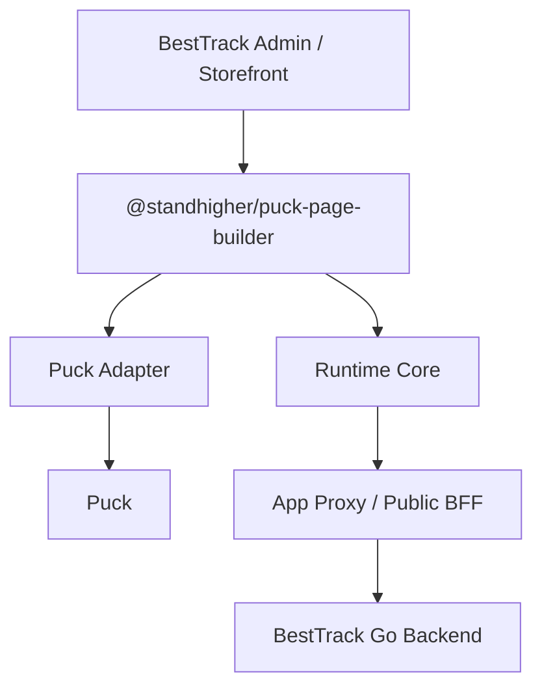

### 2.1 模块职责

| 模块 | 职责 |
|---|---|
| Schema Core | 平台自有 PageDocument、校验、迁移 |
| Extension Core | 合并并注册业务扩展 |
| Editor Core | 编辑器外壳、会话状态、操作、预览和 Polaris UI 适配 |
| Puck Adapter | PageDocument 与 Puck Data/Config 相互转换 |
| Runtime Core | 环境、数据源、权限、语言、埋点 |
| Renderer | Web、Email 等目标渲染 |
| BestTrack Extension | Tracking 区块、模板、字段、数据源和发布动作 |
| Go Backend/BFF | 保存、发布、版本、Shopify/物流接口代理 |

### 2.2 按框架复用边界分层

该视图用于说明产品场景、BestTrack 业务代码、公共 npm 包、具体技术实现和后端服务之间的边界。

```mermaid
block-beta
    columns 10

    SceneTitle["产品场景层"]:2
    block:SceneLayer:8
        columns 4
        Scene1["Admin Editor"]
        Scene2["Mock / Live Preview"]
        Scene3["Tracking Page"]
        Scene4["Email Render Job"]
    end

    BusinessTitle["BestTrack 业务扩展层"]:2
    block:BusinessLayer:8
        columns 4
        Business1["Tracking / Product Block"]
        Business2["Field / Action"]
        Business3["Template / Validator"]
        Business4["Business DataSource"]
    end

    CoreTitle["Page Builder 核心层"]:2
    block:CoreLayer:8
        columns 4
        Core1["PageDocument / Schema"]
        Core2["Editor Core"]
        Core3["Extension Registry"]
        Core4["Runtime / Validation / Migration"]
    end

    AdapterTitle["适配与渲染层"]:2
    block:AdapterLayer:8
        columns 4
        Adapter1["Puck Adapter"]
        Adapter2["Web Renderer"]
        Adapter3["Email Renderer"]
        Adapter4["Mock / Live DataSource / ApiClient"]
    end

    ServiceTitle["服务支撑层"]:2
    block:ServiceLayer:8
        columns 4
        Service1["App Proxy / BFF"]
        Service2["BestTrack Go Backend"]
        Service3["Shopify / Tracking API"]
        Service4["PostgreSQL / Redis / Telemetry"]
    end

    Service2 --> Adapter2
    Adapter2 --> Core2
    Core2 --> Business2
    Business2 --> Scene2

    classDef scene fill:#eaf1ff,stroke:#4f7cff,color:#1f2937;
    classDef business fill:#fff1df,stroke:#ff922b,color:#1f2937;
    classDef core fill:#f1eaff,stroke:#845ef7,color:#1f2937;
    classDef adapter fill:#e7f5ff,stroke:#228be6,color:#1f2937;
    classDef service fill:#e9f9e8,stroke:#40c057,color:#1f2937;
    classDef title fill:transparent,stroke:transparent,color:#1f2937,font-weight:bold;

    class Scene1,Scene2,Scene3,Scene4 scene;
    class Business1,Business2,Business3,Business4 business;
    class Core1,Core2,Core3,Core4 core;
    class Adapter1,Adapter2,Adapter3,Adapter4 adapter;
    class Service1,Service2,Service3,Service4 service;
    class SceneTitle,BusinessTitle,CoreTitle,AdapterTitle,ServiceTitle title;

    style SceneLayer fill:#f5f8ff,stroke:#4f7cff,stroke-width:1px
    style BusinessLayer fill:#fff8ef,stroke:#ff922b,stroke-width:1px
    style CoreLayer fill:#faf7ff,stroke:#845ef7,stroke-width:1px
    style AdapterLayer fill:#f2f9ff,stroke:#228be6,stroke-width:1px
    style ServiceLayer fill:#f2fbf1,stroke:#40c057,stroke-width:1px
```

| 层级 | 核心职责 |
|---|---|
| 产品场景层 | 提供页面编辑、预览、Storefront 和邮件等实际使用入口 |
| BestTrack 业务扩展层 | 承载 Tracking Page 的区块、字段、模板、动作和业务规则 |
| Page Builder 核心层 | 提供稳定、业务无关的页面模型、编辑器和扩展协议 |
| 适配与渲染层 | 对接 Puck、Web/Email 渲染和不同运行环境的数据访问 |
| 服务支撑层 | 提供网关、Go 服务、Shopify/物流接口、存储和观测能力 |

依赖约束：产品场景依赖业务扩展，业务扩展依赖 Page Builder Core；Core 不依赖 BestTrack，不暴露 Puck 数据结构，也不保存具体接口 URL。

### 2.3 按核心能力域分层

该视图用于研发模块拆分、代码目录规划和负责人划分。各能力域围绕 PageDocument 协作，不要求形成严格的单向业务流程。

```mermaid
block-beta
    columns 10

    ProductTitle["编辑与交付能力级"]:2
    block:ProductCapability:8
        columns 4
        Editor1["Shell / Toolbar / Canvas"]
        Editor2["History / Device Preview"]
        Delivery1["Mock / Live Preview / Renderer"]
        Delivery2["Publish / Version / Rollback"]
    end

    RuntimeTitle["扩展与运行能力级"]:2
    block:RuntimeCapability:8
        columns 4
        Extension1["Block / Field / Action"]
        Extension2["Template / UI Slots / Registry"]
        Runtime1["Context / DataSource / State"]
        Runtime2["Permission / I18n / Telemetry"]
    end

    DocumentTitle["文档基础能力级"]:2
    block:DocumentCapability:8
        columns 4
        Document1["PageDocument"]
        Document2["Schema / Validation"]
        Document3["Migration"]
        Document4["Version Model"]
    end

    Document2 --> Runtime1
    Runtime1 --> Editor2

    classDef product fill:#eaf1ff,stroke:#4f7cff,color:#1f2937;
    classDef runtime fill:#fff1df,stroke:#ff922b,color:#1f2937;
    classDef document fill:#f1eaff,stroke:#845ef7,color:#1f2937;
    classDef title fill:transparent,stroke:transparent,color:#1f2937,font-weight:bold;

    class Editor1,Editor2,Delivery1,Delivery2 product;
    class Extension1,Extension2,Runtime1,Runtime2 runtime;
    class Document1,Document2,Document3,Document4 document;
    class ProductTitle,RuntimeTitle,DocumentTitle title;

    style ProductCapability fill:#f5f8ff,stroke:#4f7cff,stroke-width:1px
    style RuntimeCapability fill:#fff8ef,stroke:#ff922b,stroke-width:1px
    style DocumentCapability fill:#faf7ff,stroke:#845ef7,stroke-width:1px
```

| 能力域 | 核心职责 |
|---|---|
| Editor Framework | 编辑器外壳、画布、工具栏、历史和设备预览 |
| Extension Framework | 业务扩展注册、装配与 UI 扩展机制 |
| Document Framework | 页面标准模型、Schema、校验、迁移和版本模型 |
| Runtime Framework | 运行环境、数据源、状态、权限、语言和埋点 |
| Delivery Framework | Mock/Live Preview、发布、版本、回滚和最终渲染交付 |

两张图的定位不同：2.2 用于解释整体边界和依赖方向；2.3 用于指导公共包内部的模块拆分与研发实施。

图形统一从底层向上提供能力。每层采用固定 10 列栅格：左侧层标题占 2 列，右侧能力容器占 8 列，内部 4 个能力单元等宽排列。各层在垂直方向共享相同左边界和能力区起点，减少自动居中造成的错位及文字截断。

### 2.4 Shopify Polaris UI 规范

Page Builder 面向 Shopify App 矩阵复用，Admin 端统一遵守 Shopify App Design Guidelines 与 Polaris 设计规范，使编辑器与 Shopify Admin 的视觉和交互保持一致。

#### 适用边界

| 界面 | UI 规范 |
|---|---|
| Admin 页面、EditorShell、Toolbar、属性面板、弹窗和反馈 | 必须使用 Polaris 风格 |
| Shopify Admin 外层标题栏、导航和系统级操作 | 使用 App Bridge 能力 |
| 画布中的 Tracking Page、Storefront 页面 | 按商家品牌和模板配置，不强制使用 Polaris |
| Email 最终内容 | 按邮件模板和客户端兼容性渲染，不强制使用 Polaris |

#### 实现约束

- 优先使用 Shopify 官方 Polaris 组件、页面模式和交互规范，已有公共能力优先复用 `@standhigher/shopify-app-kit`；
- 颜色、间距、圆角、阴影、字体和交互状态使用 Polaris Design Token，禁止在业务组件中重复硬编码；
- Polaris 没有对应能力时才开发自定义组件，自定义组件应保持相同的视觉、键盘行为和状态反馈；
- 页面必须覆盖 Loading、Empty、Error、Disabled、Success 和 Unsaved Changes 等标准状态；
- 表单、弹窗、破坏性操作、Toast、Banner 和确认流程遵循 Shopify Admin 的交互习惯；
- 支持 Shopify Admin 桌面端和移动端，并满足键盘操作、焦点管理、语义标签和颜色对比度要求；
- Polaris 依赖集中在 `ui/polaris` 适配层，不进入 `PageDocument`、Extension API 和 Runtime 协议，避免 UI 库升级影响页面数据。

组件使用顺序：

```text
App Bridge 系统级组件
  → Polaris 组件与页面模式
  → @standhigher/shopify-app-kit 公共封装
  → 少量业务自定义组件
```

---

## 3. Puck 隔离与替换设计

持久化层不直接保存 Puck Data，而保存平台自有 `PageDocument`。Puck 只作为当前编辑引擎存在于 Adapter 内部。


```ts
interface EditorEngineAdapter<TEngineData> {
  toEngineData(document: PageDocument): TEngineData;
  fromEngineData(data: TEngineData, base: PageDocument): PageDocument;
  buildEngineConfig(extensions: ResolvedExtensions): unknown;
}
```

Puck 对应关系：

| 平台能力 | Puck 接入点 |
|---|---|
| Block / Field | `Config.components`、`fields`、`render` |
| 左侧区块和大纲 | `blocks`、`outline` Plugins |
| 顶部与界面扩展 | Composition、Plugins；必要时使用 Overrides |
| 多设备预览 | `viewports`、`Puck.Preview` |
| 国际化 | `dictionary` |
| 编辑权限 | `permissions`、`resolvePermissions` |
| 编辑器数据 | 仅 Adapter 内使用 Puck Data |

约束：Puck UI Overrides 属于高变更风险接口，只能在 `puck-adapter` 内使用；业务扩展不得直接依赖 Puck API。

---

## 4. PageDocument 数据设计

### 4.1 页面结构

```ts
type RenderTarget = "web" | "email";

interface PageDocument {
  schemaVersion: number;
  pageId: string;
  target: RenderTarget;
  templateId?: string;
  root: Record<string, unknown>;
  blocks: BlockNode[];
  settings: PageSettings;
}

interface BlockNode {
  id: string;
  type: string;
  version: number;
  props: Record<string, unknown>;
  slots?: Record<string, BlockNode[]>;
  binding?: DataBinding;
}

interface DataBinding {
  source: string;
  params?: Record<string, JsonValue>;
}
```

### 4.2 保存示例

```json
{
  "schemaVersion": 1,
  "pageId": "page_123",
  "target": "web",
  "templateId": "branded",
  "root": { "background": "#ffffff" },
  "blocks": [
    {
      "id": "block_tracking_1",
      "type": "tracking.query",
      "version": 1,
      "props": {
        "title": "Track your order",
        "buttonText": "Track"
      }
    }
  ],
  "settings": {
    "locale": "en",
    "seoTitle": "Track your order"
  }
}
```

### 4.3 数据约束

- 固定能力由 BlockDefinition 声明，Schema 无需重复保存 DataSource Key；
- 仅通用动态区块允许保存 `binding.source`；
- `source` 必须存在于 Registry 白名单；
- 不保存 API URL、Token、密钥、函数和完整 Shopify 响应；
- 商品等资源只保存稳定 ID 和渲染所需快照；
- 每个页面和区块均有版本号，支持顺序迁移。

---

## 5. Extension API

### 5.1 统一定义

```ts
interface PageBuilderExtension {
  name: string;
  version: string;
  blocks?: BlockDefinition[];
  fields?: FieldDefinition[];
  actions?: EditorAction[];
  renderers?: RendererDefinition[];
  dataSources?: DataSourceDefinition[];
  templates?: TemplateDefinition[];
  hooks?: LifecycleHooks;
  validators?: Validator[];
  slots?: UISlots;
  i18n?: I18nMessages;
  permissions?: PermissionRules;
  features?: FeatureFlags;
  assets?: AssetProvider;
  telemetry?: TelemetryProvider;
}
```

### 5.2 扩展装配流程

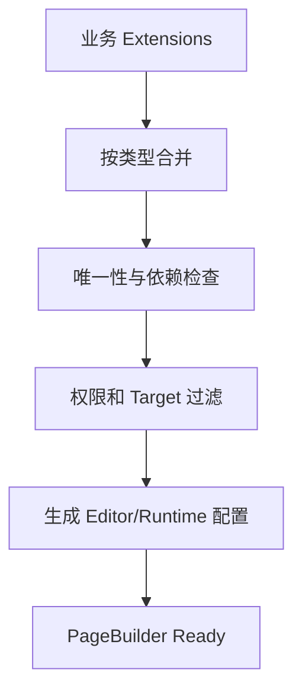

规则：

- Registry ID 使用命名空间，例如 `besttrack.tracking.query`；
- ID 冲突默认启动失败，不允许静默覆盖；
- Block、Template、Renderer 必须声明支持的 `target`；
- Extension 初始化失败时阻止编辑器启动，并返回明确错误；
- 合并结果只读，页面运行中不得动态改写 Registry。

---

## 6. Block 与 Field 设计

### 6.1 BlockDefinition

```ts
interface BlockDefinition<P = Record<string, unknown>> {
  type: string;
  version: number;
  label: string;
  category: string;
  targets: Array<RenderTarget | "all">;
  defaultProps: P;
  fields: Record<keyof P, FieldConfig>;
  dataSources?: string[];
  render: Partial<Record<RenderTarget, React.ComponentType<P>>>;
  validate?: (props: P) => ValidationIssue[];
  migrate?: BlockMigration[];
}
```

### 6.2 FieldDefinition

```ts
interface FieldDefinition<T = unknown> {
  type: string;
  component: React.ComponentType<FieldProps<T>>;
  normalize?: (value: T) => T;
  validate?: (value: T) => ValidationIssue[];
}
```

BestTrack 首期 Field：

| Field | 保存内容 | 数据访问 |
|---|---|---|
| ProductPicker | Product ID + 最小快照 | Go BFF 代理 Shopify Admin API |
| CollectionPicker | Collection ID + 最小快照 | Go BFF |
| ImagePicker | 文件 ID、URL、alt | Shopify Files/BFF |
| MenuPicker | Menu ID、标题 | Shopify Menu/BFF |
| LinkPicker | 受控 URL 类型和值 | 本地校验 |

字段选择发生在 Admin 编辑阶段；消费者交互数据通过 Runtime DataSource 获取，两者不得混用。

---

## 7. 编辑器与 Action 设计

### 7.1 界面结构

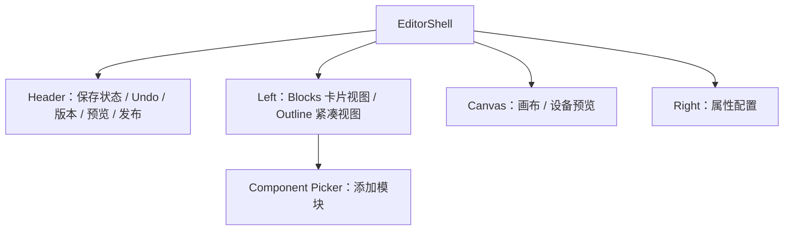

基础包内置：Undo/Redo、Dirty 状态、设备切换、缩放、Mock Preview。  
业务扩展提供：保存、Live Preview、发布、下线、复制、版本历史、发布到 Shopify Menu。

交互约束：

- Blocks 与 Outline 读取同一份区块列表和 `selectedBlockId`，切换时不复制或转换数据；
- Blocks 使用卡片形式强调排序、复制、删除和添加模块；
- Outline 使用紧凑列表强调层级、定位和快速切换；
- “添加模块”打开独立 Component Picker，由 BlockRegistry 提供可添加区块；
- Canvas、Blocks、Outline 和 Fields 的选中状态必须双向同步；
- Canvas 保持 iframe 隔离，Admin Polaris 样式不得进入消费者页面。

### 7.2 EditorContext

```ts
interface EditorContext {
  document: PageDocument;
  selectedBlockId?: string;
  saveState: "clean" | "dirty" | "saving" | "saved" | "failed" | "conflict";
  previewMode: "editor" | "mock-preview" | "live-preview";
  publishState: "draft" | "publishing" | "published" | "publish-failed";
  revision: number;
  device: "desktop" | "tablet" | "mobile" | "full";
  zoom: "auto" | number;
  editorLocale: string;
  pageLocale: string;
  getDocument(): PageDocument;
  updateDocument(next: PageDocument): void;
  selectBlock(blockId?: string): void;
  save(): Promise<SaveResult>;
  undo(): void;
  redo(): void;
  setDevice(device: DeviceType): void;
}
```

### 7.3 ActionDefinition

```ts
interface EditorAction {
  id: string;
  label: string;
  position: "left" | "center" | "right";
  order?: number;
  variant?: "default" | "primary" | "danger";
  hidden?: (ctx: EditorContext) => boolean;
  disabled?: (ctx: EditorContext) => boolean;
  execute(ctx: EditorContext): Promise<void> | void;
}
```

Action 只负责编排；保存、发布等业务逻辑分别进入 Service 和 Lifecycle Hooks。

顶部动作固定区分：自动保存草稿、Mock/Live Preview、发布/发布变更、添加到店铺菜单。Undo/Redo 仅表示当前会话历史，版本入口仅表示持久化版本历史。

---

## 8. Runtime Context 与 DataSource

### 8.1 Runtime Context

```ts
interface RuntimeContext {
  mode: "editor" | "preview" | "runtime";
  dataMode: "mock" | "live";
  target: RenderTarget;
  shop?: string;
  pageLocale: string;
  dataSources: DataSourceRegistry;
  apiClient?: ApiClient;
  state: RuntimeState;
  assets?: AssetProvider;
  permissions?: PermissionProvider;
  features?: FeatureFlags;
  telemetry?: TelemetryProvider;
}
```

### 8.2 数据源选择

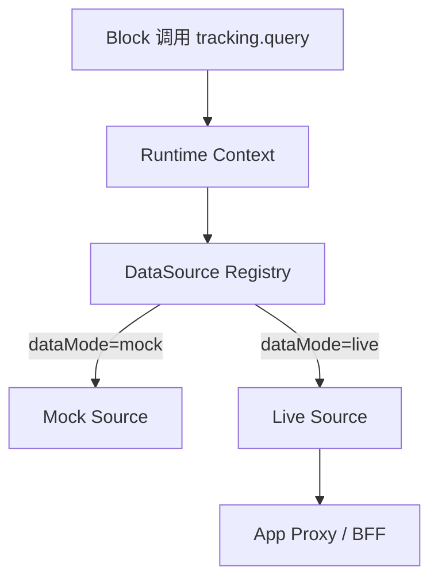

| 场景 | `mode` | `dataMode` |
|---|---|---|
| 编辑画布 | editor | mock |
| 普通预览 | preview | mock |
| 真实预览 | preview | live |
| 消费者页面 | runtime | live |

Preview 入口提供 Mock Preview 与 Live Preview。Live Preview 必须显式触发并校验权限，不允许通过设备切换隐式进入真实数据模式。

### 8.3 Preview Settings

查询编号、物流状态等演示数据属于编辑器预览配置，不属于 PageDocument：

```ts
interface PreviewSettings {
  pageId: string;
  dataMode: "mock" | "live";
  pageLocale: string;
  fixtures?: Record<string, unknown>;
}
```

Preview Settings 仅保存在编辑会话或独立预览存储中，发布时必须剔除。消费者页面始终通过 Runtime DataSource 获取真实数据。

### 8.4 DataSourceDefinition

```ts
interface DataSourceDefinition<P = unknown, R = unknown> {
  key: string;
  mock: DataSource<P, R>;
  live: DataSource<P, R>;
  validateParams?: (params: P) => ValidationIssue[];
  normalize?: (result: unknown) => R;
}

interface DataSource<P, R> {
  execute(params: P, context: RuntimeContext): Promise<R>;
}
```

```tsx
const query = useDataSource<TrackingParams, TrackingResult>(
  "besttrack.tracking.query"
);

const result = await query.execute({ trackingNumber });
```

`useDataSource` 对外提供 `idle/loading/success/error` 状态、取消请求和 reset。查询结果默认存放在 Block 本地状态；多个区块共享结果时，通过 `RuntimeState` 使用受控 `stateKey`，不写入 PageDocument。

### 8.5 API URL 配置

```text
Block → DataSource → ApiClient → Runtime Config → App Proxy/BFF → Go Backend
```

- PageDocument 和 Block Props 均不保存 URL；
- `baseURL` 来自环境配置，endpoint 固化在业务 ApiClient；
- Storefront 使用同源 App Proxy，如 `/apps/besttrack/tracking/query`；
- Admin 数据访问统一进入 Go BFF，再代理 Shopify Admin GraphQL；
- ApiClient 统一处理超时、Request ID、错误映射和可取消请求；
- 只对幂等请求执行有限重试。

### 8.6 物流查询流程

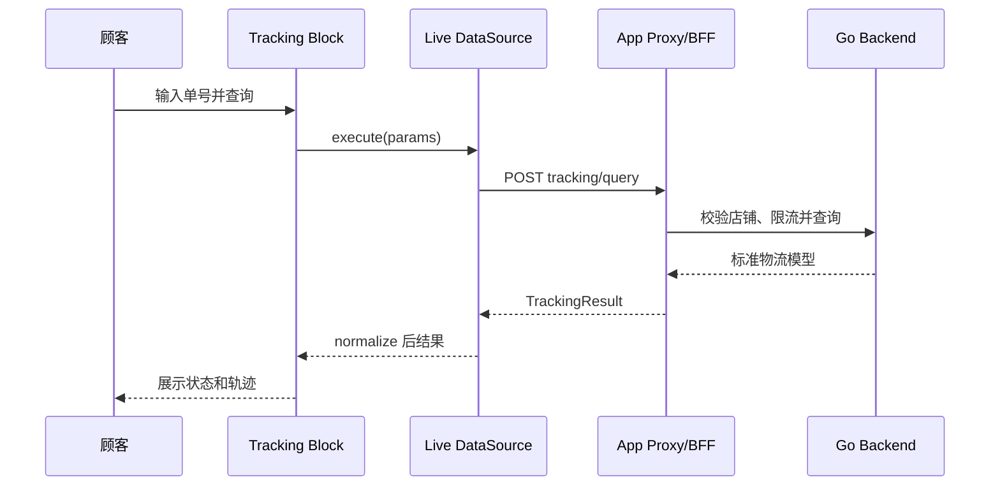

---

## 9. Renderer 设计

### 9.1 统一入口

```ts
interface RendererDefinition {
  target: RenderTarget;
  render(document: PageDocument, runtime: RuntimeContext): React.ReactNode | string;
}
```

### 9.2 渲染分工

| 项目 | Web Renderer | Email Renderer |
|---|---|---|
| 执行位置 | 浏览器/Next.js | 服务端 |
| 输出 | React 页面 | HTML + Inline CSS |
| 区块范围 | `web/all` | `email/all` |
| 动态数据 | Runtime DataSource | 发送前数据上下文 |
| 交互 | 支持 | 不支持或降级 |
| 安全 | URL/HTML 校验 | HTML 清洗、CSS 内联 |

渲染前统一执行：Schema Migration → Validation → Target Filter → Renderer。

---

## 10. 模板设计

```ts
interface TemplateDefinition {
  id: string;
  version: number;
  name: string;
  target: RenderTarget;
  thumbnail?: string;
  create(): PageDocument;
}
```

模板只负责创建初始 PageDocument。页面创建后与模板解耦，模板升级不自动覆盖商家页面。

首期模板：

| 模板 | 主要内容 |
|---|---|
| Ready-to-go | 基础物流查询与结果 |
| Branded | 品牌头图、品牌内容、查询与推荐 |
| Sales | 查询、商品/集合与营销转化区块 |

---

## 11. 保存、发布与版本

### 11.1 页面生命周期

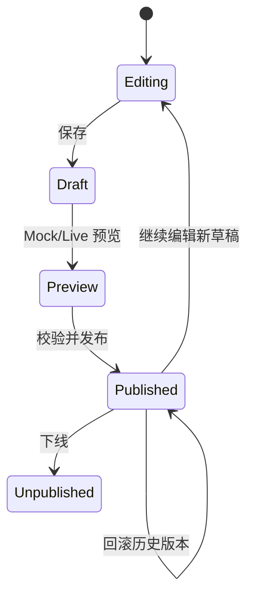

保存、发布与菜单关联为独立动作：自动保存只更新草稿；发布生成不可变版本；菜单关联失败不回滚已发布版本，并允许单独重试。

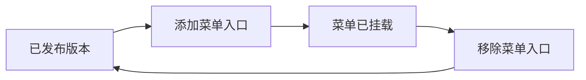

### 11.2 数据模型

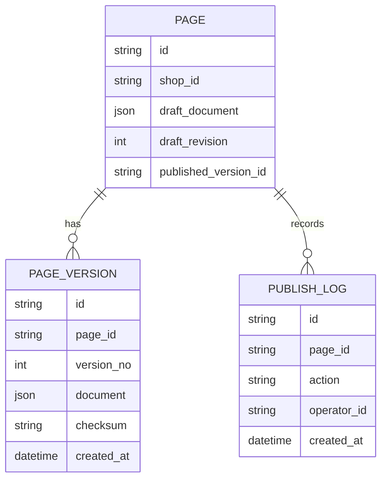

设计约束：

- 草稿保存在 `PAGE.draft_document`；
- 每次保存增加 `draft_revision`；
- 发布时创建不可变 `PAGE_VERSION`；
- `published_version_id` 原子切换，失败时保持旧版本；
- 回滚是将历史版本重新发布为一个新版本；
- 使用 `expectedRevision` 做乐观锁，避免后保存覆盖先保存。

### 11.3 API 契约

| API | 用途 | 关键参数 |
|---|---|---|
| `GET /admin/pages/{id}` | 获取页面和草稿 | pageId |
| `PUT /admin/pages/{id}/draft` | 保存草稿 | document、expectedRevision |
| `POST /admin/pages/{id}/preview-sessions` | 创建 Live Preview | draftRevision |
| `POST /admin/pages/{id}/publish` | 发布当前草稿 | draftRevision |
| `GET /admin/pages/{id}/versions` | 获取版本历史 | pageId |
| `POST /admin/pages/{id}/rollback` | 回滚历史版本 | versionId |
| `POST /admin/pages/{id}/unpublish` | 下线 | pageId |
| `POST /admin/pages/{id}/menu-links` | 添加到店铺菜单 | menuId、title |
| `DELETE /admin/pages/{id}/menu-links/{linkId}` | 移除菜单入口 | linkId |
| `GET /apps/besttrack/pages/{handle}` | 获取已发布页面 | shop、handle |
| `POST /apps/besttrack/tracking/query` | 消费者物流查询 | trackingNumber/order |

Live Preview 使用服务端生成的短时预览凭证，只允许访问指定 shop、page 和 revision。

---

## 12. Lifecycle、校验与迁移

### 12.1 生命周期

```ts
interface LifecycleHooks {
  onChange?(document: PageDocument): void;
  beforeSave?(document: PageDocument): Promise<PageDocument>;
  afterSave?(result: SaveResult): Promise<void>;
  beforePublish?(document: PageDocument): Promise<PageDocument>;
  afterPublish?(result: PublishResult): Promise<void>;
  onError?(error: PageBuilderError): void;
}
```

### 12.2 校验顺序

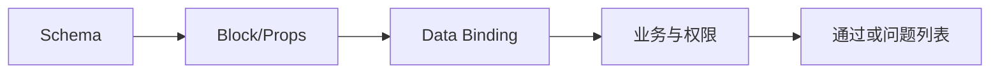

发布前必须校验：

- Schema 版本、结构和大小；
- Block 是否注册、版本是否可迁移；
- Props、URL、图片、商品和菜单是否合法；
- Block 与目标 Web/Email 是否兼容；
- DataSource 是否注册，binding 参数是否受控；
- 套餐权限和 Feature Flag；
- Tracking Page 必需查询区块是否存在。

### 12.3 迁移策略

```ts
type Migration<T> = {
  from: number;
  to: number;
  migrate(input: T): T;
};
```

加载顺序：PageDocument Migration → Block Migration → Validate。迁移函数必须纯函数、可重复执行并有 Fixture 测试；迁移成功后在下一次保存时写回新版本。

---

## 13. 权限、Feature Flag 与 I18n

### 13.1 权限分层

| 层级 | 示例 |
|---|---|
| 编辑权限 | 是否允许新增、删除、拖拽、发布 |
| 套餐权限 | Sales 模板或高级区块仅 Pro 可用 |
| 页面权限 | 只读、可编辑、可发布 |
| 数据权限 | 是否允许 Live Preview、访问某 DataSource |

前端权限只控制交互；保存、发布和真实数据接口必须由后端再次校验。

### 13.2 国际化

- `I18nProvider` 统一输出 `t(key, params)`；
- Puck 自带 UI 文案映射到 `dictionary`；
- Block、Field、Action、Template 标签使用业务语言包；
- 页面内容语言属于 PageDocument，不与编辑器界面语言混用；
- 首期支持中文、英文、西班牙语、葡萄牙语和法语。

---

## 14. Asset Provider

```ts
interface AssetProvider {
  search(params: AssetSearchParams): Promise<AssetPage>;
  upload?(file: File): Promise<Asset>;
  get(id: string): Promise<Asset>;
}
```

首期接入 Shopify Files/BFF。PageDocument 保存资源 ID、稳定 URL、alt、宽高和必要快照；发布前检查资源有效性，不保存上传凭证。

---

## 15. 异常与安全

### 15.1 统一错误

```ts
interface PageBuilderError {
  code: string;
  message: string;
  source: "editor" | "schema" | "datasource" | "renderer" | "publish";
  retryable: boolean;
  cause?: unknown;
}
```

| 场景 | 处理方式 |
|---|---|
| Mock 数据异常 | 显示区块级占位和错误信息 |
| Live 查询失败 | 区块级错误，可重新查询 |
| 草稿冲突 | 提示内容已更新，重新加载后合并/再保存 |
| 发布校验失败 | 阻止发布并定位到具体区块 |
| 发布服务失败 | 保持旧线上版本 |
| 未注册 Block | 编辑器显示 Unknown Block，禁止发布 |

### 15.2 安全基线

- App Proxy 请求由 Go 后端校验 Shopify 签名和 shop 上下文；
- 物流查询接口执行限流、输入校验、敏感信息脱敏和防滥用策略；
- Live Preview 凭证短时有效、指定资源、不可用于 Admin API；
- 禁止任意 URL、动态脚本和不受控表达式；
- Email HTML 服务端清洗，Web URL 进行协议白名单校验；
- 日志不得记录 Token、完整订单信息和敏感物流查询输入。

---

## 16. Telemetry 与性能

### 16.1 事件

```text
editor_open / block_add / block_remove / field_change
draft_save / preview_open / publish_start / publish_success / publish_failed
datasource_request / datasource_error / renderer_error / schema_migration
```

事件统一包含：`app`、`shop`、`pageId`、`target`、`mode`、`blockType`、`duration`、`errorCode`；不上传 Block 完整内容。

### 16.2 性能基线

- Field Picker、模板预览和非当前 Renderer 按需加载；
- 编辑变更本地实时生效，自动保存采用防抖；
- DataSource 支持取消、去重和受控缓存；
- 预览 iframe 与 Admin 同源并隔离样式；
- 发布版本按 `checksum` 缓存，切换版本后主动失效；
- 对 PageDocument 设置区块数、嵌套深度和 JSON 大小上限。

---

## 17. 推荐目录

```text
packages/puck-page-builder/src
├── core
│   ├── schema
│   ├── extensions
│   ├── validation
│   └── migration
├── adapters/puck
├── editor
│   ├── shell
│   ├── actions
│   ├── history
│   └── preview
├── ui/polaris
├── runtime
│   ├── context
│   ├── state
│   └── datasource
├── renderer
│   ├── web
│   └── email
├── fields
├── assets
├── permissions
├── i18n
├── telemetry
└── testing

apps/besttrack
├── admin/page-editor
├── storefront/tracking-page
└── extensions/page-builder
    ├── blocks
    ├── fields
    ├── templates
    ├── data-sources
    ├── actions
    └── validators
```

依赖约定：`@puckeditor/core` 使用 `peerDependency`，Puck 类型不得从公共业务接口透出。

---

## 18. 测试与验收

### 18.1 测试分层

| 类型 | 核心内容 |
|---|---|
| 单元测试 | Registry 冲突、Schema、Migration、Validation、DataSource |
| 组件测试 | Block、Field、Action、权限、多语言、异常态 |
| UI 规范测试 | Polaris 组件使用、Design Token、响应式、键盘与焦点行为 |
| Adapter 测试 | PageDocument 与 Puck Data 双向转换 |
| 契约测试 | Mock/Live 返回同一标准模型，前后端 API Schema 一致 |
| E2E | 创建→拖拽→配置→保存→预览→发布→查询→回滚 |
| Renderer 测试 | Web 视觉回归、Email HTML 快照与兼容性 |

### 18.2 本期验收主链路

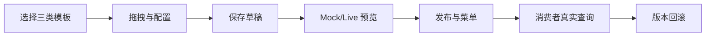

验收标准：

- 同一 PageDocument 在 Editor、Preview、Runtime 正确渲染；
- Editor/Mock Preview 不调用真实物流接口；
- Live Preview/Runtime 通过 App Proxy/BFF 调用真实接口；
- 页面数据不包含接口 URL、密钥和完整 Shopify 对象；
- 发布失败不影响线上版本，历史版本可回滚；
- Web/Email Target 不兼容区块无法添加或发布；
- Blocks 卡片视图与 Outline 紧凑视图共享区块、选中和排序状态；
- Preview 入口明确区分 Mock 与 Live，设备切换不会触发真实请求；
- Preview Settings 不进入 PageDocument 和已发布版本；
- 自动保存、发布版本和菜单关联状态相互独立；
- Editor Language 与 Page Locale 相互独立且不会串改；
- Admin 编辑器符合 Polaris 风格，桌面端和移动端核心操作可用；
- 通用组件优先使用 Polaris，不重复实现 Button、Form、Modal、Banner、Toast 等基础能力；
- 自定义 UI 不硬编码颜色、间距、圆角、阴影和字体，统一使用 Design Token；
- Puck 仅存在于 Adapter，实现层可替换且业务扩展不直接依赖 Puck。

---

## 19. 实施顺序

| 阶段 | 交付 |
|---|---|
| 1. Core | PageDocument、Registry、Validation、Migration、Puck Adapter |
| 2. Editor | Polaris UI Adapter、Shell、Block/Field、Action、Undo/Redo、设备预览、I18n |
| 3. Runtime | Runtime Context、Mock/Live DataSource、ApiClient、状态管理 |
| 4. Business | 三类模板、Tracking/商品/集合/图片/菜单能力 |
| 5. Delivery | 草稿、Live Preview、发布、版本、回滚、Shopify Menu |
| 6. Quality | Web/Email Renderer、权限、Telemetry、测试和文档 |

每个阶段必须以可运行示例和自动化测试作为完成标准，不以接口空实现作为交付。

---

## 20. 官方参考

- [Shopify App Design Guidelines](https://shopify.dev/docs/apps/design)
- [Shopify App Home 与 Polaris](https://shopify.dev/docs/api/app-home/latest)
- [Polaris Reference](https://shopify.dev/docs/api/polaris)
- [Puck Component Configuration](https://puckeditor.com/docs/integrating-puck/component-configuration)
- [Puck External Data Sources](https://puckeditor.com/docs/integrating-puck/external-data-sources)
- [Puck Data Migration](https://puckeditor.com/docs/integrating-puck/data-migration)
- [Puck Viewports](https://puckeditor.com/docs/integrating-puck/viewports)
- [Puck Localization](https://puckeditor.com/docs/integrating-puck/localization)
- [Puck Feature Toggling](https://puckeditor.com/docs/integrating-puck/feature-toggling)
- [Puck Plugin API](https://puckeditor.com/docs/extending-puck/plugins)
- [Puck UI Overrides](https://puckeditor.com/docs/extending-puck/ui-overrides)

## 21. 最终约定

`@standhigher/puck-page-builder` 对外暴露稳定的 PageDocument、Extension API、Runtime Context 和 Renderer 协议；Puck 只作为内部编辑引擎。Admin 编辑器统一遵守 Shopify Polaris 设计规范，Polaris 依赖隔离在 UI 适配层，消费者页面继续支持商家品牌定制。业务区块只调用注册的数据能力，不感知接口 URL 和运行环境；编辑器注入 Mock DataSource，Live Preview 与消费者页面注入 Real DataSource，所有真实请求统一经过 App Proxy/BFF。
